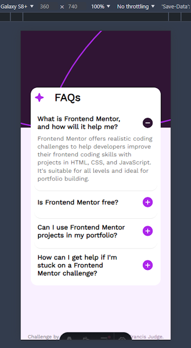
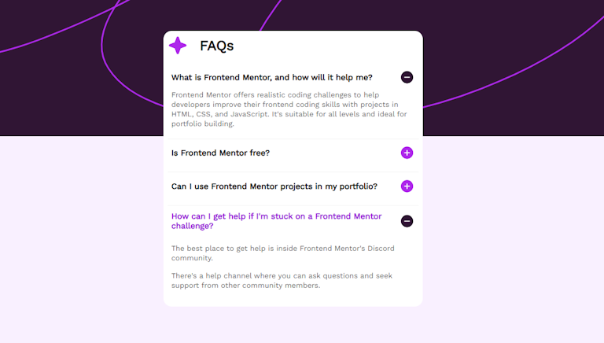

# FAQ accordion solution (Frontend Mentor)

This is my solution to
the [FAQ accordion challenge on Frontend Mentor](https://www.frontendmentor.io/challenges/faq-accordion-wyfFdeBwBz).
Frontend Mentor challenges help you improve your coding skills by building realistic projects.

## Table of contents

- [Overview](#overview)
    - [Screenshot](#screenshot)
    - [Links](#links)
- [My process](#my-process)
    - [Built with](#built-with)
    - [What I learned](#what-i-learned)
- [Author](#author)

## Overview

### Screenshots

#### Mobile view

#### Desktop view

### Links

- Solution URL: https://github.com/FJSolutions/fm-faq-accordion/
- Live Site URL: https://fbj-faq-accordion.netlify.app/

## My process

### Built with

- Semantic HTML5 markup
- CSS custom properties
- Flexbox
- Mobile-first workflow
- [Astro](https://astro.build/)
- [AlpineJS](https://alpinejs.dev/) - for interactivity
- [LightningCSS](https://lightningcss.dev/) - For styles
- [Cloudflare Workers](https://dash.cloudflare.com/)

### What I learned

It was my first time using `astro` for anything and I have wanted to use it for project for some
time - what a great experience! All the benefits of client-side components but all done at compile
time. I made three levels of abstraction: page layout, page, faq-item component &ndash; with I made
interactive with `alpinejs`.

Using `alpinejs` in `astro` was a breeze as the setup wit well documented and easily searchable in
their documentation. I am now set on `lightningcss` for CSS processing so there were very few new
things (ie. it was a low risk project).

Using Lighthouse in Google Chrome is getting easier and there are fewer things to find and fix every
timer I check it.

I have been using [Netlify](https://app.netlify.com/) up to now for deployment as it is incredibly
easy to use, but I have been wanting to use [Cloudflare](https://dash.cloudflare.com/) for a while
as they provide a database option. I would like to use that for a side project in the near
future. It proved to be a incredibly easy to setup and deploy. Unfortunately I had to move it back
to Netlify as Frontend Mentor doesnt accept Cloudflare.

Fot the first time doing a Frontend Mentor project I came in ahead of time! I mostly put this down
to increased familiarity with the tools I'm using.

## Author

- Frontend Mentor - [Francis Judge](https://www.frontendmentor.io/profile/FJSolutions)
